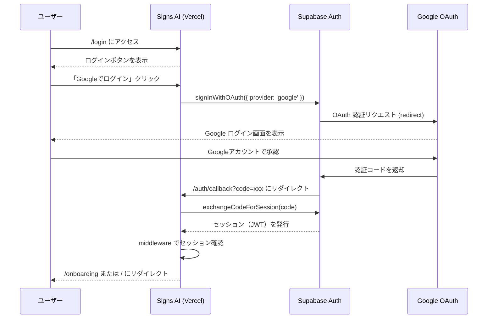

# 認証フロー（Google OAuth + Supabase）

Signs AI は **Supabase Auth** を経由した Google OAuth 2.0 で認証を行います。

---

## フロー図



---

## 各ステップの詳細

### 1. ログインページ（`/login`）

- `supabase.auth.signInWithOAuth({ provider: 'google', options: { redirectTo: ... } })` を呼び出し
- `redirectTo` には `/auth/callback` を指定

### 2. コールバック処理（`/auth/callback`）

`src/app/auth/callback/route.ts` で処理：

```ts
const { error } = await supabase.auth.exchangeCodeForSession(code);
```

- 成功 → ユーザーが `users` テーブルに存在するか確認
  - 存在する → `/` (ダッシュボード) にリダイレクト
  - 存在しない（初回） → `/onboarding` にリダイレクト
- 失敗 → `/login?error=auth_failed` にリダイレクト

### 3. ミドルウェア（`middleware.ts`）

全リクエストで Supabase のセッションを検証：
- **未認証ユーザー** → 保護されたページへのアクセスを `/login` にリダイレクト
- **認証済みユーザー** が `/login` にアクセス → `/` にリダイレクト

```ts
// 認証不要のパブリックルート
const PUBLIC_ROUTES = ["/", "/login", "/marketing", "/survey", "/auth/callback"];
```

> ⚠️ `/` （ダッシュボード）はパブリックルートに含まれているため、未ログインでもアクセス可能ですが、Supabase からの実データ取得はできずダミーデータが表示されます。

---

## 関連する外部サービス設定

| サービス | 設定箇所 | 設定内容 |
|---|---|---|
| Supabase | Authentication → URL Configuration | Redirect URLs に本番 URL を追加 |
| Google Cloud | OAuth 2.0 クライアント | 承認済みリダイレクト URI に本番 URL を追加 |

詳細は [README.md](../README.md) の「本番環境へのデプロイ手順 ②③」を参照。
